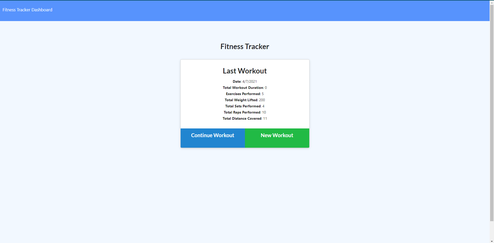

# Workout Tracker

## Table of Contents
1. [Description](#Description)
2. [Installation](#Installation)
3. [Usage](#Usage)
4. [License](#License)
5. [Contributing](#Contributing)
6. [Questions](#Questions)

## Description
This full stack web application allows users to save exercises to previous workouts or create new workouts. MongoDB is used as the database to store exercise data with ExpressJS routing the requests.

## Installation
In order to install the application, follow these steps: 

Follow the link to this website: https://workout-tracker-a.herokuapp.com/

## Usage
The application is deployed at: https://workout-tracker-a.herokuapp.com/

## License
This application is not protected under a license

## Contributing
NA

## Tests
In order to test the application, follow these steps:

NA

## Questions
You can find my other applications on my github page
Github: [mautrey17](https://github.com/mautrey17) 

Or you can email me at: mautrey17@gmail.com

